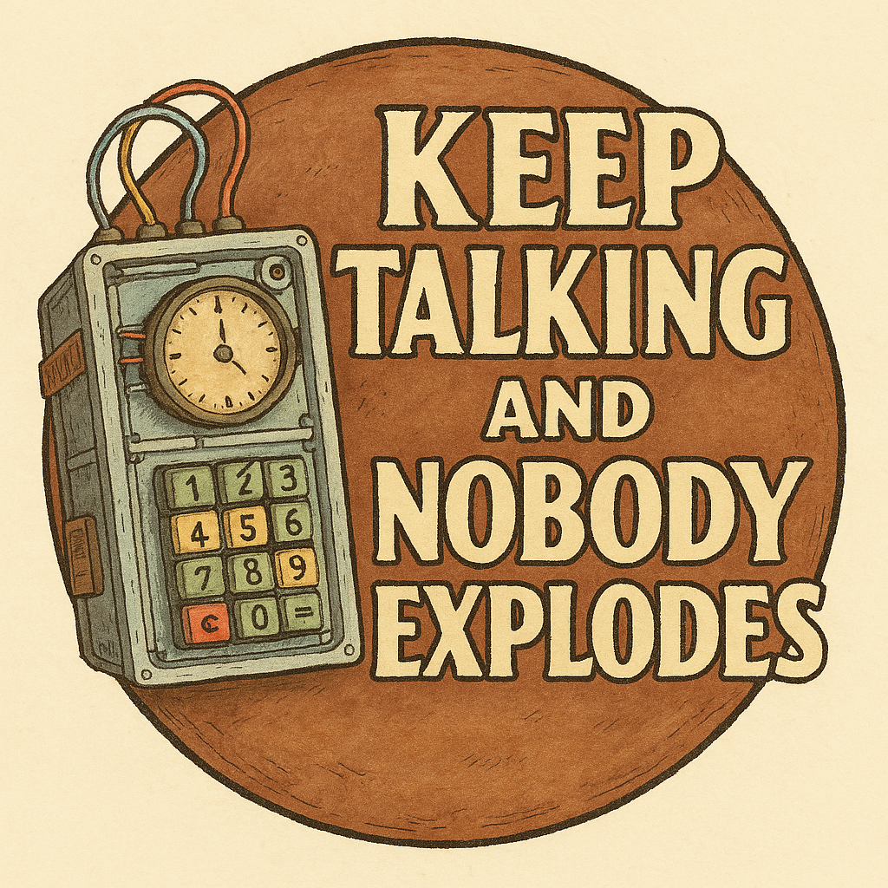

# 💣 Assignment: LLM Bomb Defusal with Multi-Agent Systems
<p align="center">
  
</p>

## 🔍 Overview
This assignment introduces you to multi-agent communication using Large Language Models (LLMs) in an interactive game environment inspired by “Keep Talking and Nobody Explodes.”
You’ll simulate a cooperative bomb defusal scenario where two roles — **Defuser** and **Expert** — must work together to prevent a bomb from exploding. The challenge lies in building intelligent agents that can collaborate, communicate, and problem-solve using natural language.

This is a practical dive into:
- **Tool usage** in LLM applications
- **Prompt engineering** for task-solving agents
- [**MCP (Model Context Protocol)**](https://www.anthropic.com/news/model-context-protocol) for communication 
- [**CrewAI**](https://www.crewai.com/), a framework for building scalable multi-agent systems

By the end, you'll create a multi-agent CrewAI setup where LLMs act as cooperative agents to defuse a virtual bomb.

## ✅ Task 0 - Setup & Exploration
Before building agents or clients, you need to set up the environment and understand how the game system works.

### 📦 **Steps**:
1. Clone the project repository and read the README.md carefully. 
2. Install all required dependencies (preferably in a virtual environment). 
3. Familiarize yourself with the codebase, especially the game logic and MCP server. 
4. Try running the game in manual mode to interact with the bomb yourself to understand how commands work.

This will give you the foundation needed to build your own intelligent, collaborative agents.

## 🔁 TASK 1 - MCP [5 points]
The [Model Context Protocol](https://modelcontextprotocol.io/introduction) is an open standard that enables developers to build secure, two-way connections between their data sources and AI-powered tools. The architecture is straightforward: developers can either expose their data through [MCP servers](https://modelcontextprotocol.io/quickstart/server) or build AI applications ([MCP clients](https://modelcontextprotocol.io/quickstart/client)) that connect to these servers.
### 🧩 Task 1.1 - Client implementation [3.5 points]
Implement the core classes in `game_mcp/game_client.py` that represent the two roles in the game:
- `BombClient` – Handles server connection and message exchange 
- `Defuser` – Receives bomb module information and performs actions 
- `Expert` – Provides instructions based on the module’s manual

You will need to:
- Parse server messages 
- Send appropriate commands based on role
- Implement logic for managing module state and role responsibilities
 
### 🧪 Task 1.2 - Client testing [1.5 points]
Write a `main()` function in the `game_mcp/game_client.py` file to run your clients.
Requirements:
- Accept two command-line arguments:
  - `--url` – Server URL (e.g., http://localhost:8080)
  - `--role` – Either "Defuser" or "Expert"

Your client should:
- Connect to the MCP server
- Send and receive messages continuously
- Simulate either the Defuser or Expert role using console I/O

This sets up the foundation for simulating multi-agent play using human input.

# 🤖 TASK 2 - LLM Agents & Prompt Engineering [10 points]

In this task, you'll experiment with different prompt engineering techniques and model parameters to optimize your LLM agents' performance in the bomb defusal game.

## 📋 Requirements:

### 🧠 TASK 2.1 Prompt Structure Experimentation [3 points]
- Test **at least three different** prompt structures:
  - **Standard text-based prompts** – natural, conversational instructions
  - **Structured markdown** – prompts with section headers like `### Observation` and `### Instructions`
  - **JSON-formatted prompts** – use structured fields (e.g., `{ "role": "Expert", "input": ..., "output": ... }`)
  
### 🎛️ TASK 2.2 Parameter Tuning [3 points]
- Experiment with different LLM inference parameters:
  - **Temperature** – try low (0.1–0.3), medium (0.5–0.7), and high (0.8–1.0) values
  - **Top-p (nucleus sampling)** - compare performance at different thresholds
  - **Top-k** - if your chosen LLM supports it

### 📊 TASK 2.3 Methodology & Analysis [2 points]
- For each configuration, track:
  - **Success rate** - modules defused successfully
  - **Conversation efficiency** - exchanges needed to solve
  - **Error patterns or hallucinations**

### 📝 TASK 2.4 Report & Visualization [2 points]
- **MANDATORY**: Prepare a concise report (maximum **one page**, excluding any images or plots) summarizing your experiments
- 📈 Include **at least one visualization** (plot/chart) showing the relationship between parameters and performance
- 💡 Provide clear, **evidence-based recommendations** for "optimal" configurations

## 👥 TASK 3 - Multi-Agent Systems with CrewAI [15 points]
Manually coordinating LLMs (e.g., by piping messages between them) gets tedious fast. Instead, we’ll use **CrewAI** – a framework for building structured, multi-agent LLM systems.
### 🔧 Task 3.1 – Tools Integration [3 points]
Inject your DefuserClient and ExpertClient logic into CrewAI tools. Each tool should:
- Accept string input from the CrewAI agent
- Return a response generated by the Defuser Client or Expert Client

These tools will act as building blocks for your agents inside the CrewAI ecosystem.

💡 **Tip**: When creating your own tools in CrewAI, you may need to handle custom input schemas. To allow tools to accept flexible inputs, you can configure the model like this:
```python
model_config = ConfigDict(extra='allow')
```
This enables your tools to work with inputs beyond the default structure. Adjust the `extra` parameter (`'allow'`, `'forbid'`, or `'ignore'`) depending on how strict you want the input validation to be.

### 👨‍👨‍👧 TASK 3.2 - Building a CrewAI Team [7 points]
Use CrewAI to define a team of cooperative agents in the `crewai_bomb/crew.py` file.
- One agent plays the **Defuser** 
- One agent plays the **Expert**

Design a workflow where:
- The Defuser describes the module and waits for a reply
- The Expert processes the description and provides instructions
- The task continues until the module is solved or the bomb explodes

Feel free to add any additional Python or configuration files if needed to structure your CrewAI setup more cleanly—especially if it helps organize your tools, prompts, or agent logic more effectively. You're encouraged to extend the setup in a way that makes your team easier to test or reuse.

⚠️ **Important**: The quality of your prompts and the effectiveness of your agents will be a significant part of your final grade.
To demonstrate your results, you are encouraged to include:
- Screenshots of working CrewAI sessions 
- Output logs showing agent interaction
- Any evidence that illustrates how well your agents cooperated

💡 **Tip**: If you’d like to run smaller LLMs locally (instead of relying on APIs), check out [**Connect to any LLM**](https://docs.crewai.com/how-to/llm-connections) in the CrewAI documentation.
We recommend using `ollama/qwen2.5:1.5b` for a lightweight and capable model that runs well on most machines. Of course, you're also free to use hosted APIs like OpenAI, Hugging Face, or others based on your preferences and setup.

### 🧾 Task 3.3 – CrewAI Agent Behavior Report [5 points]
As a final step, write a short evaluation report summarizing how your CrewAI agents performed in practice.
This doesn't need to be long (maximum **one page**, excluding any images or plots) or formal—just a concise write-up of your observations.

#### ✍️ Your report should include:
- 🛠 **Tool Usage**: Did the LLM agents understand how to use the tools you provided? Were there any issues in how they called or interpreted them?
- 🤖 **Model Behavior**: Describe how well the LLMs behaved in their roles (Defuser and Expert). Did they stay in character? Did they respond logically?
- 🔁 **Model Swapping Insights**: Try running your CrewAI setup with a smaller model, like Smollm2:360m, qwen2.5:0.5b, another lightweight model, or even something extra powerful like DeepSeekR1 or o3-mini-high (if you like and have the resources).
  - What changed in the agents’ responses?
  - Did the model still use tools correctly? 
  - Was reasoning or instruction-following impacted?
- ⚠️ **Common Challenges**: Reflect on any problems you encountered, such as:
  - Models with limited context windows losing track of the conversation
  - Agents misunderstanding the game logic or prompt
  - Hallucinations or incorrect tool usage


## 📤 Results Submission

When you're done, please prepare your submission as follows:

📁 **Folder Structure**: Create a folder named: xy<your_index_number> (e.g., xy123456)

Inside this folder, include:
- ✅ All your source code (client implementations, prompts, CrewAI setup, etc.). Keep the folder structure as it is.
- ✅ Your short behavior report as a `report.pdf`

🗜️ **Packaging**: Zip the entire folder into: xy<your_index_number>.zip

📬 **Submission**: Upload the zipped file to Moodle under the assignment submission section.

Make sure everything runs correctly (you can even write in `report.pdf` your python version) and is well-organized before submission. Incomplete submission may affect your grade.